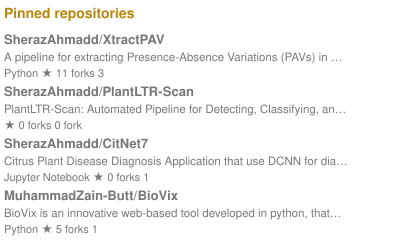
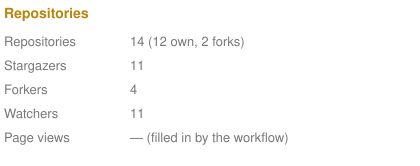
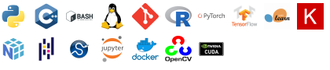

  

Bioinformatics Research Associate at SBASSE, LUMS, Lahore. I build tools for reading
genomes: read aligners, variant extraction pipelines and transposon scanners, written
mostly in C++ and Python and run on Linux.

 

  

### Utility belt

&nbsp;
&nbsp;
&nbsp;
&nbsp;
&nbsp;
&nbsp;
&nbsp;
&nbsp;
&nbsp;
&nbsp;
&nbsp;
&nbsp;
&nbsp;
&nbsp;

 
&nbsp;
&nbsp;
&nbsp;
&nbsp;
&nbsp;
&nbsp;
&nbsp;
&nbsp;
&nbsp;
&nbsp;
&nbsp;
&nbsp;
&nbsp;
&nbsp;
&nbsp;
&nbsp;
&nbsp;
&nbsp;
&nbsp;
&nbsp;
&nbsp;
 

 

### Connect with me

  &nbsp;
  &nbsp;
  &nbsp;
  &nbsp;
  &nbsp;
  

 

<h3 align="center">Affiliations</h3>

  &nbsp;
  &nbsp;
  &nbsp;
  &nbsp;
  &nbsp;
  

