

  

Bioinformatics Research Associate at SBASSE, LUMS, Lahore. I build tools for reading genomes: read aligners, variant extraction pipelines and transposon scanners, written mostly in C++ and Python and run on Linux.

<!-- pinned:start -->

<a href="https://github.com/SherazAhmadd/XtractPAV">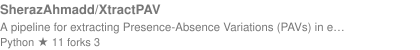</a>
<a href="https://github.com/SherazAhmadd/PlantLTR-Scan">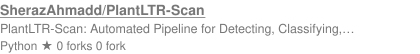</a>

<a href="https://github.com/MuhammadZain-Butt/BioVix">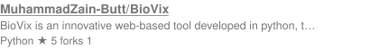</a>
<!-- pinned:end -->
<a href="https://github.com/SherazAhmadd?tab=repositories">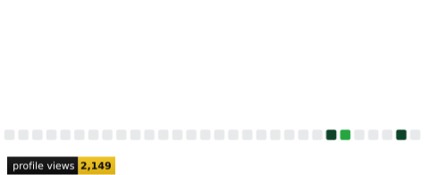</a> 
&nbsp;&nbsp;<a href="https://scholar.google.com/citations?user=wmPI3XYAAAAJ&amp;hl=en">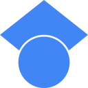</a>&nbsp;<a href="https://kaggle.com/sherazzahmad">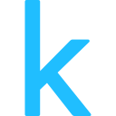</a>&nbsp;&nbsp;
 
<a href="https://github.com/SherazAhmadd?tab=repositories">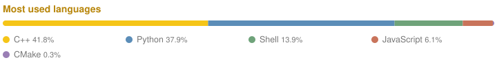</a>

<a href="https://github.com/SherazAhmadd?tab=repositories">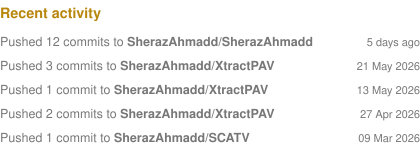</a>
 
<a href="https://www.nextflow.io">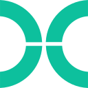</a>&nbsp;
<a href="https://nf-co.re">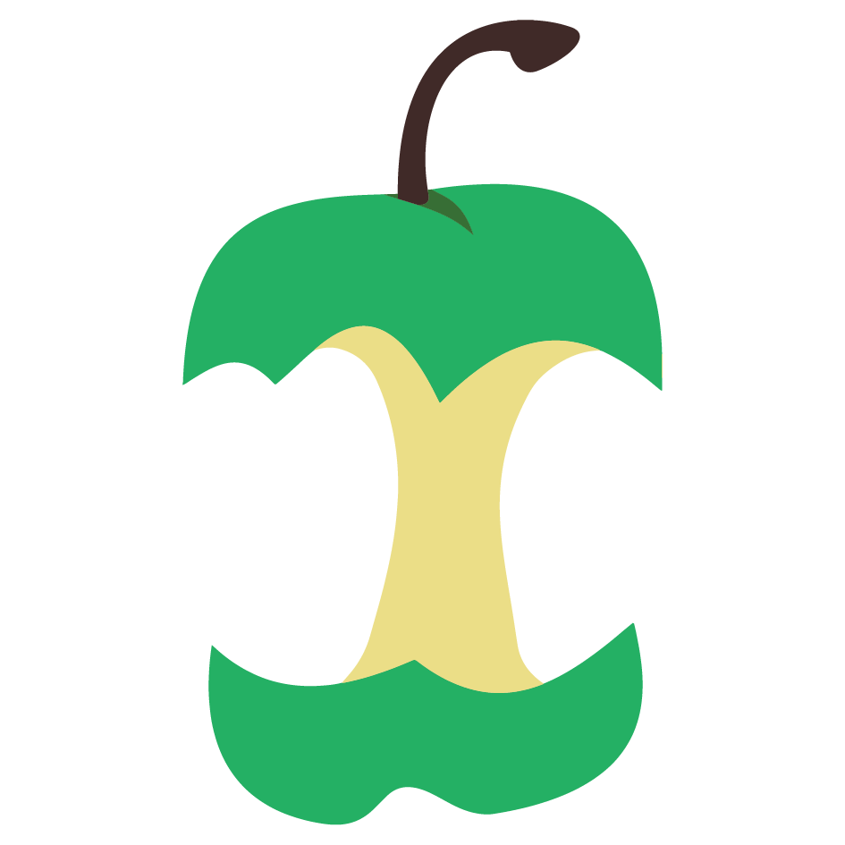</a>&nbsp;
<a href="https://snakemake.github.io">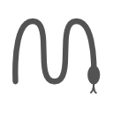</a>&nbsp;
<a href="https://bioconductor.org">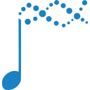</a>&nbsp;
<a href="https://biopython.org">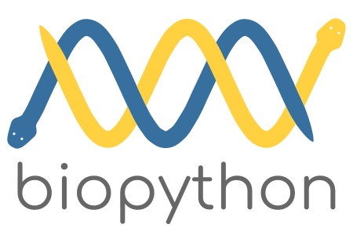</a>&nbsp;
<a href="https://www.ncbi.nlm.nih.gov">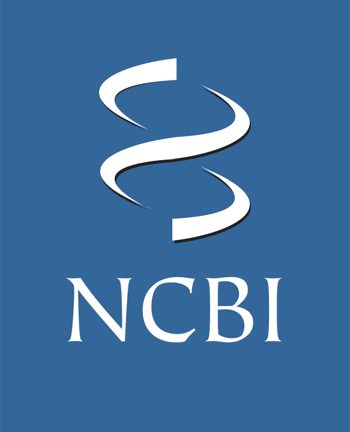</a>&nbsp;
<a href="https://pymol.org">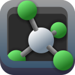</a>&nbsp;
&nbsp;
<a href="https://posit.co/products/open-source/rstudio/">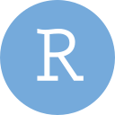</a>&nbsp;
&nbsp;
&nbsp;
&nbsp;
&nbsp;
&nbsp;
 
 
&nbsp;
&nbsp;
&nbsp;
&nbsp;
&nbsp;
&nbsp;
&nbsp;
&nbsp;
&nbsp;
&nbsp;
<a href="https://deeptools.readthedocs.io">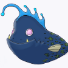</a>&nbsp;
&nbsp;
&nbsp;
<a href="https://bioconductor.org/packages/DESeq2/">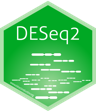</a>&nbsp;
<a href="https://bioconductor.org/packages/edgeR/">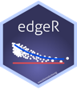</a>&nbsp;
<a href="https://bioconductor.org/packages/limma/">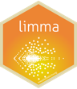</a>&nbsp;
&nbsp;
&nbsp;
<a href="https://iqtree.github.io">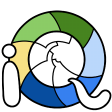</a>&nbsp;
&nbsp;
&nbsp;
<a href="https://www.rdkit.org">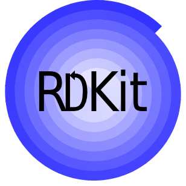</a> 
 
&nbsp;
<a href="https://github.com/topics/cpp">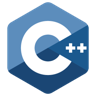</a>&nbsp;
<a href="https://github.com/topics/bash">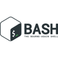</a>&nbsp;
&nbsp;
<a href="https://github.com/topics/git">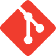</a>&nbsp;
&nbsp;
<a href="https://github.com/topics/pytorch">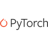</a>&nbsp;
&nbsp;
&nbsp;
&nbsp;
&nbsp;
<a href="https://github.com/topics/pandas">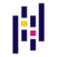</a>&nbsp;
&nbsp;
&nbsp;
&nbsp;
<a href="https://github.com/topics/opencv">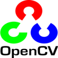</a>&nbsp;
 
<a href="https://github.com/SherazAhmadd?tab=repositories">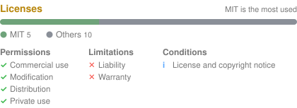</a>
 

<a href="https://github.com/SherazAhmadd?tab=following">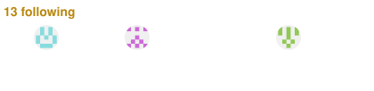</a>
 

   
  &nbsp;
  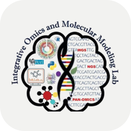&nbsp;
  &nbsp;
  <a href="https://www.chalmers.se/en/">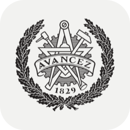</a>&nbsp;
  &nbsp;
  &nbsp;
  

